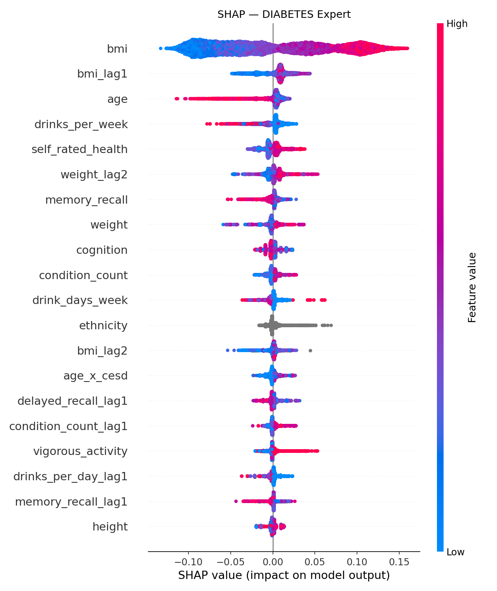
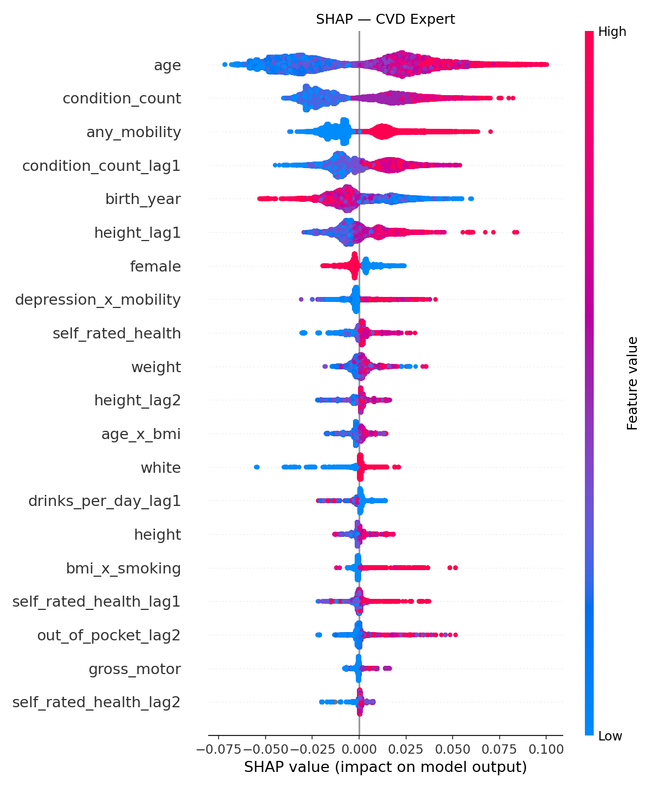
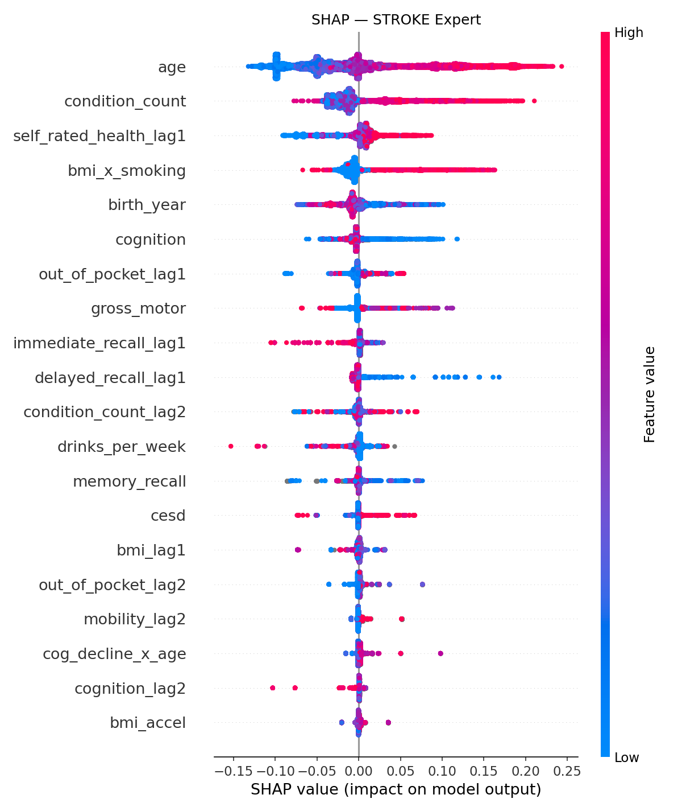
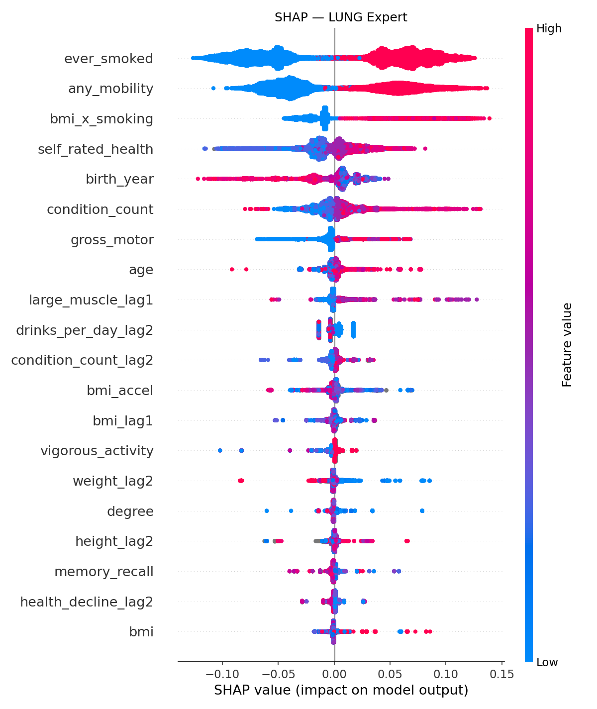
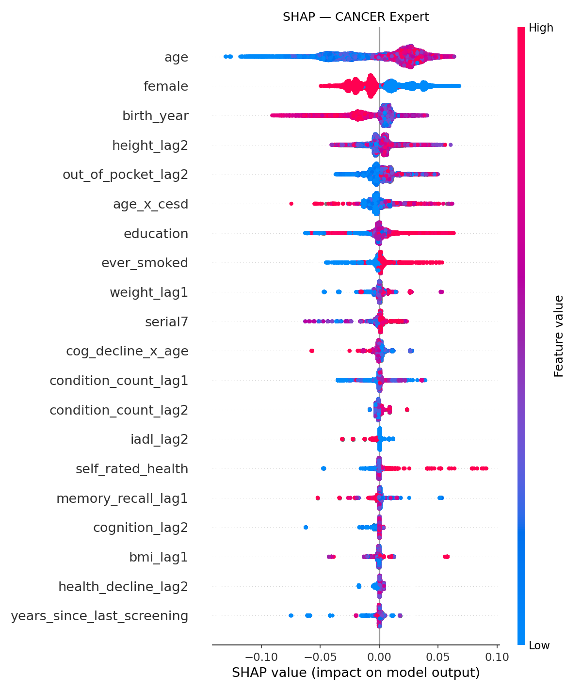
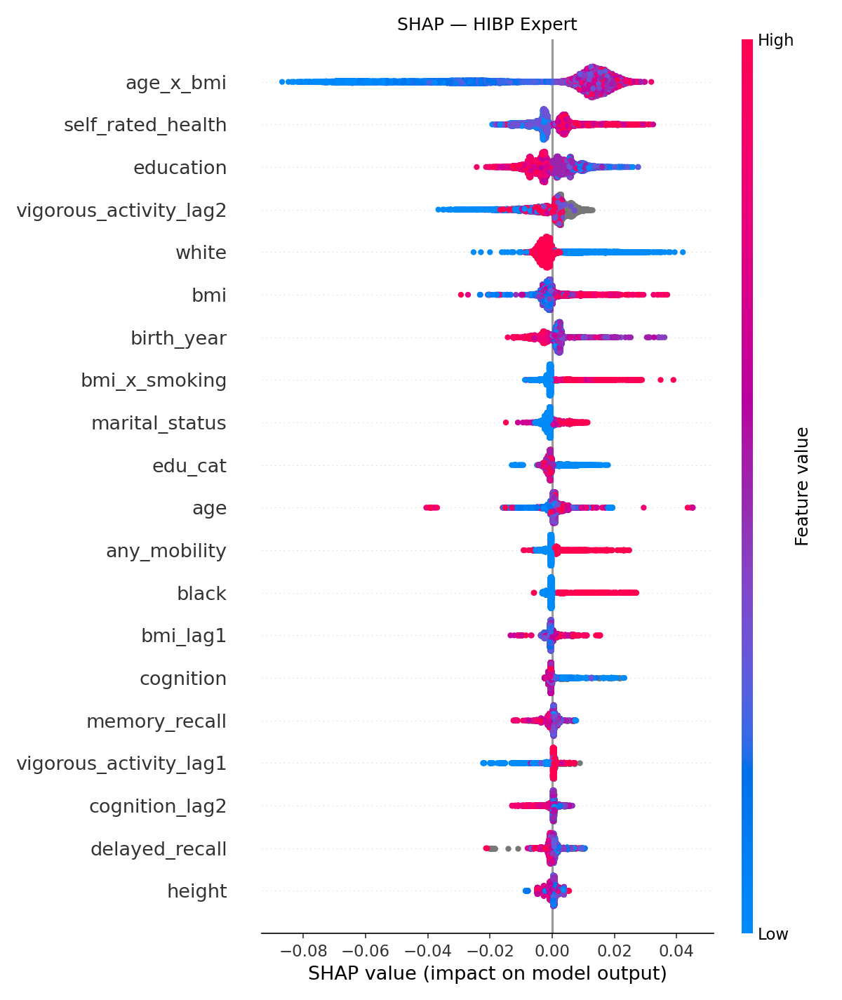
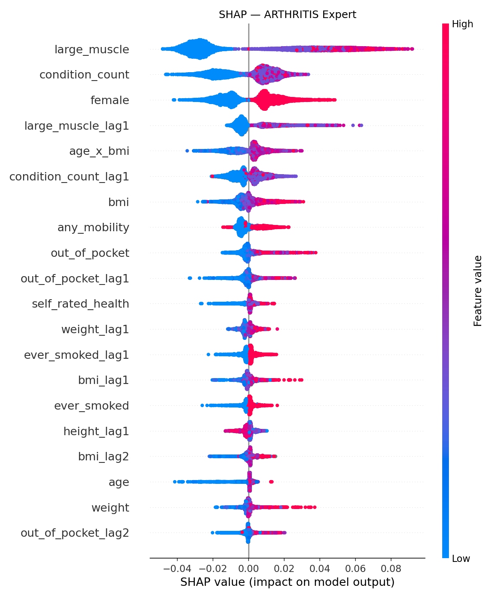
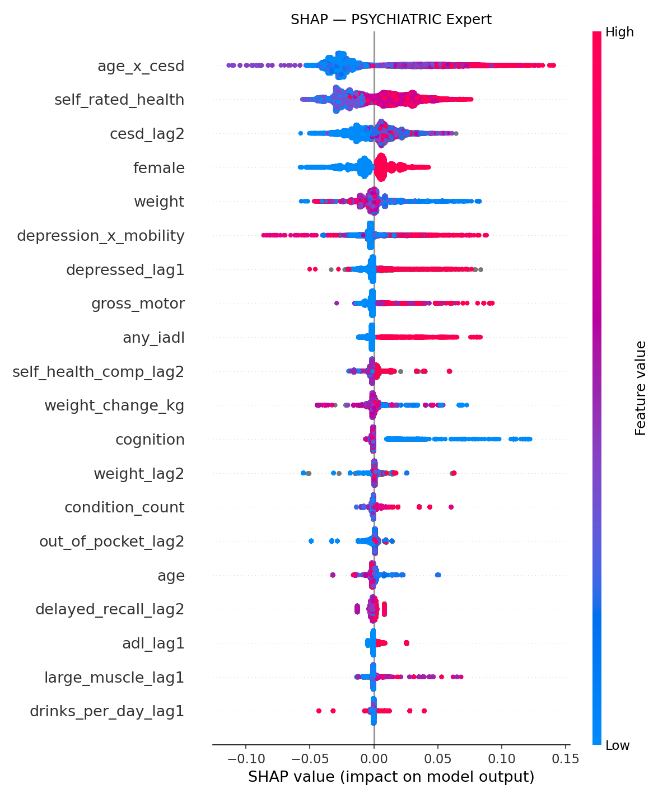

# AI in Search of Hidden Health Signals

## Hybrid Disease-Expert Ensemble — Disease Onset Prediction

> **Dataset**: [RAND HRS Longitudinal File (1992–2022 v1)](https://hrsdata.isr.umich.edu/data-products/rand-hrs-longitudinal-file-2022)
> **Goal**: Predict new disease onset within a 4-year horizon (~2 HRS screenings) using temporal health features and an ensemble of gradient-boosted models.
> **Metrics**: ROC-AUC · PR-AUC · F2 Score · Precision · Recall · Threshold

---

## Project Structure

```
├── notebook optuna.ipynb       # Full pipeline (data → train → evaluate → explain)
├── output_hybrid/              # Results, SHAP plots, feature importance
│   ├── results.json
│   ├── feature_importance_experts.csv
│   ├── shap_*.png              # One per disease
│   └── saved_models/           # Serialized ensembles (joblib .pkl)
├── randhrs1992_2022v1.sas7bdat # Raw HRS data (SAS format, ~7 GB)
├── sasfmts.sas7bdat            # SAS format catalog
└── randhrs1992_2022v1.pdf      # HRS codebook
```

---

## Notebook Walkthrough

The notebook (`notebook optuna.ipynb`) runs the entire pipeline end-to-end in **13 cells**:

### Cell 1 — Imports

Loads core libraries: NumPy, Pandas, scikit-learn metrics, LightGBM, CatBoost, XGBoost.

### Cell 2 — Configuration

| Constant | Value | Purpose |
|---|---|---|
| `SEED` | 42 | Reproducibility |
| `FEATURE_SCREENINGS` | 5–12 | HRS waves used as feature windows |
| `PREDICTION_HORIZON` | 2 | Predict outcome 2 screenings ahead (~4 years) |
| `LAGS` | 2 | Number of previous screenings to include as lag features |
| `DISEASE_MAP` | 9 diseases | Maps disease names → HRS variable codes |
| `SCREENING_VARS` | 27 variables | Health/behavioral variables extracted per screening (BMI, cognition, depression, smoking, etc.) |

### Cell 3 — Feature Extraction (`extract_screening_features`)

For each HRS screening wave, extracts:
- **Demographics**: age, sex, ethnicity (White/Black/Hispanic/Other), education
- **Screening date**: derived from SAS interview-midpoint dates
- **Health variables**: current values + lag-1 and lag-2 (raw values from previous screenings)
- **Time gaps**: years since last screening

Each person-screening becomes one row with ~150 columns.

### Cell 4 — Temporal Feature Engineering (`add_temporal_features`)

Computes derived features from the raw screening values:

| Category | Examples |
|---|---|
| **BMI trajectories** | `bmi_delta_lag1`, `bmi_accel`, `weight_change_pct`, `rapid_weight_gain/loss` |
| **Health perception** | `health_decline_lag1`, `health_worsening`, `health_crash` (≥2 point drop) |
| **Functional decline** | `mobility_decline`, `adl_worsening`, `new_mobility_problem` |
| **Cognitive decline** | `cog_decline_lag1`, `sharp_cog_drop` (>3), `low_cognition` (<12) |
| **Mental health** | `cesd_increase`, `elevated/high/chronic_depression` |
| **Behaviors** | `former_smoker`, `quit_smoking`, `heavy_drinking` (>14 drinks/week) |
| **Interactions** | `age × bmi`, `age × cesd`, `depression × mobility`, `cog_decline × age` |
| **Composites** | `metabolic_risk`, `frailty_score` |

### Cell 5 — Target Creation (`create_targets`)

For each disease, compares self-reported status at baseline vs. outcome screening:
- **Eligible**: disease = 0 at baseline (the person doesn't have it yet)
- **Onset target**: transitions from 0 → 1 between baseline and outcome
- HRS codes 3 (disputes prior diagnosis) and 4 (don't know) are treated as missing and excluded

### Cell 6 — Dataset Assembly (`build_master_features` + `get_disease_dataset`)

1. **`build_master_features`**: loops over screenings 5–12, stacks into a long-format master table (~362K rows)
2. **`get_disease_dataset`**: filters to eligible patients for a specific disease and performs a **group-aware train/test split** (80/20) ensuring no person appears in both sets

### Cell 7 — Expert Model Training (`train_disease_expert`)

For each disease, trains a 3-model ensemble:

1. **Optuna hyperparameter tuning** (20 trials, 3-min timeout) optimizes CatBoost `learning_rate`, `depth`, and `l2_leaf_reg` on ROC-AUC
2. **Final CatBoost**: retrained with best params, 3000 iterations, early stopping at 300
3. **LightGBM**: 2000 estimators, GPU with CPU fallback
4. **XGBoost**: 2000 estimators, CUDA hist method

All three models use `scale_pos_weight` to handle class imbalance. The final prediction is the **simple average** of the three models' probabilities.

### Cell 8 — Evaluation (`find_best_f2_threshold` + `evaluate_expert`)

Searches for the optimal **F2-score threshold** (grid from 0.02 to 0.60). F2 weights recall more than precision — appropriate for disease screening where missing a case is worse than a false alarm.

### Cell 9 — Any-Onset Meta-Ensemble (`build_any_onset_from_experts`)

Combines all disease-specific probabilities into a single "any disease onset" probability:

```
P(any onset) = 1 - ∏(1 - P_d)  for all eligible diseases d
```

### Cell 10 — SHAP Explainability (`explain_expert`)

Generates SHAP summary plots for the LightGBM model of each disease expert, saved as `shap_{disease}.png`. Shows the top-20 most influential features.

### Cell 11 — Feature Importance Export (`export_importance`)

Exports `feature_importance_experts.csv` with per-feature importance from all three models and their average, for every disease.

### Cell 12 — Fairness Audit (`fairness_audit`)

Evaluates model performance (F2, precision, recall) broken down by gender and ethnicity to check for demographic disparities.

### Cell 13 — Main Execution

Orchestrates the full pipeline: load data → build features → train experts → evaluate → explain → export.

---

## Diseases Tracked

| Disease | HRS Code | Description |
|---|---|---|
| Diabetes | `DIAB` | Doctor-told diabetes |
| CVD | `HEART` | Heart disease / heart attack / CHF / angina |
| Stroke | `STROK` | Stroke or TIA |
| Lung | `LUNG` | Chronic lung disease (emphysema, COPD, asthma) |
| Cancer | `CANCR` | Cancer (excluding minor skin cancers) |
| HIBP | `HIBP` | High blood pressure / hypertension |
| Arthritis | `ARTHR` | Arthritis or rheumatism |
| Psychiatric | `PSYCH` | Psychiatric / emotional problems |
| Memory | `MEMRY` | Memory-related disease (Alzheimer's, dementia) |

---

## Key Design Decisions

- **Screening-specific codes** (not cumulative "ever" codes) — ensures clean 0→1 transitions for onset detection
- **Group-aware splitting** — prevents data leakage from the same person appearing in train and test
- **F2 score optimization** — prioritizes recall over precision (better to flag a potential onset than miss it)
- **Temporal deltas & acceleration** — captures health trajectories, not just snapshots
- **Optuna + ensemble averaging** — reduces variance and overfitting from any single model

---

## Results

### Combined Any-Onset Detection

The meta-ensemble aggregates all 9 disease expert probabilities to predict whether a person will develop **any** new disease within a 4-year window.

| Metric | Value |
|---|---|
| **ROC-AUC** | 0.6565 |
| **PR-AUC** | 0.4990 |
| **F2 Score** | 0.7318 |
| **Threshold** | 0.60 |

### Ensemble ROC-AUC Ranking

| Rank | Disease | Ensemble ROC-AUC |
|---|---|---|
| 1 | Memory | 0.8332 |
| 2 | Lung | 0.7345 |
| 3 | Psychiatric | 0.7309 |
| 4 | Diabetes | 0.7030 |
| 5 | Stroke | 0.6835 |
| 6 | CVD | 0.6822 |
| 7 | Arthritis | 0.6480 |
| 8 | HIBP | 0.6194 |
| 9 | Cancer | 0.5982 |

> Memory disease achieves the best discrimination (0.83 ROC-AUC) — cognitive decline markers are strong predictors. Cancer is the hardest to predict (0.60) since its onset depends on factors not captured in the HRS survey variables.

---

### Per-Disease Results

Each disease has its own expert ensemble of 3 models. The **Ensemble Avg** row shows the simple average of all three models' predicted probabilities, which is used as the final prediction.

#### 🩸 Diabetes

| Model | ROC-AUC | PR-AUC | F2 | Precision | Recall | Threshold |
|---|---|---|---|---|---|---|
| LightGBM | 0.6705 | 0.1204 | 0.3254 | 0.1026 | 0.7118 | 0.0870 |
| CatBoost | 0.7030 | 0.1426 | 0.3556 | 0.1196 | 0.7013 | 0.4805 |
| XGBoost | 0.7009 | 0.1405 | 0.3512 | 0.1191 | 0.6849 | 0.4747 |
| **Ensemble Avg** | **0.7030** | **0.1420** | **0.3561** | **0.1200** | **0.7006** | **0.3464** |

**Top predictors**: BMI (9.7), age (4.4), condition count (3.8), BMI lag-1 (3.7), self-rated health (3.5), age×BMI interaction (2.9), ethnicity (2.5)

> The model correctly flags ~70% of future diabetes cases. BMI and its interaction with age dominate — consistent with obesity being the strongest modifiable risk factor.

#### ❤️ Cardiovascular Disease (CVD)

| Model | ROC-AUC | PR-AUC | F2 | Precision | Recall | Threshold |
|---|---|---|---|---|---|---|
| LightGBM | 0.6631 | 0.1610 | 0.3859 | 0.1400 | 0.6879 | 0.1074 |
| CatBoost | 0.6792 | 0.1782 | 0.3995 | 0.1411 | 0.7371 | 0.4222 |
| XGBoost | 0.6815 | 0.1771 | 0.3969 | 0.1378 | 0.7486 | 0.4018 |
| **Ensemble Avg** | **0.6822** | **0.1798** | **0.3992** | **0.1365** | **0.7698** | **0.2998** |

**Top predictors**: birth year (12.5), condition count (8.8), self-rated health (5.3), BMI×smoking (3.5), female (3.4), age (3.0)

> High recall (77%) catches most future heart disease cases. Birth year is the top feature — older cohorts have higher baseline cardiovascular risk. The BMI×smoking interaction captures the compounding effect of both risk factors.

#### 🦴 Stroke

| Model | ROC-AUC | PR-AUC | F2 | Precision | Recall | Threshold |
|---|---|---|---|---|---|---|
| LightGBM | 0.6561 | 0.0543 | 0.1956 | 0.0530 | 0.5965 | 0.0433 |
| CatBoost | 0.6796 | 0.0626 | 0.1960 | 0.0551 | 0.5424 | 0.4659 |
| XGBoost | 0.6827 | 0.0631 | 0.1971 | 0.0562 | 0.5278 | 0.4776 |
| **Ensemble Avg** | **0.6835** | **0.0641** | **0.1999** | **0.0560** | **0.5585** | **0.3231** |

**Top predictors**: age (3.7), self-rated health (3.6), condition count (3.4), age² (3.0), birth year (2.2), female (2.0), memory recall (1.6)

> Low precision (5.6%) reflects stroke's rarity in the population (~3% incidence). The model identifies age and comorbidity burden as the main risk drivers.

#### 🫁 Lung Disease

| Model | ROC-AUC | PR-AUC | F2 | Precision | Recall | Threshold |
|---|---|---|---|---|---|---|
| LightGBM | 0.7052 | 0.0813 | 0.2385 | 0.0677 | 0.6460 | 0.0491 |
| CatBoost | 0.7330 | 0.1016 | 0.2618 | 0.0876 | 0.5209 | 0.5563 |
| XGBoost | 0.7306 | 0.1035 | 0.2587 | 0.0970 | 0.4437 | 0.5359 |
| **Ensemble Avg** | **0.7345** | **0.1063** | **0.2680** | **0.1048** | **0.4387** | **0.3989** |

**Top predictors**: self-rated health (3.4), condition count (3.2), birth year (3.0), ever smoked (2.5), mobility (1.7), age (1.5), BMI×smoking (1.3)

> Smoking history (`ever_smoked`) is a strong signal, and its interaction with BMI adds predictive power. Mobility limitations also contribute — respiratory disease restricts physical function.

#### 🎗️ Cancer

| Model | ROC-AUC | PR-AUC | F2 | Precision | Recall | Threshold |
|---|---|---|---|---|---|---|
| LightGBM | 0.5662 | 0.0638 | 0.2182 | 0.0578 | 0.7128 | 0.0579 |
| CatBoost | 0.6014 | 0.0734 | 0.2382 | 0.0662 | 0.6794 | 0.4601 |
| XGBoost | 0.5936 | 0.0711 | 0.2340 | 0.0629 | 0.7314 | 0.4222 |
| **Ensemble Avg** | **0.5982** | **0.0723** | **0.2355** | **0.0641** | **0.7119** | **0.3115** |

**Top predictors**: female (4.9), age (4.6), age² (4.2), height (3.0), birth year (2.9), ethnicity (2.2), out-of-pocket medical costs lag-1 (2.0)

> Weakest model (ROC-AUC ~0.60) — cancer onset depends heavily on genetic, environmental, and lifestyle factors not captured in the HRS survey. The sex disparity in feature importance reflects different cancer types by gender.

#### 🫀 High Blood Pressure (HIBP)

| Model | ROC-AUC | PR-AUC | F2 | Precision | Recall | Threshold |
|---|---|---|---|---|---|---|
| LightGBM | 0.6000 | 0.2504 | 0.5625 | 0.2162 | 0.9383 | 0.2094 |
| CatBoost | 0.6170 | 0.2678 | 0.5637 | 0.2113 | 0.9672 | 0.2969 |
| XGBoost | 0.6189 | 0.2721 | 0.5634 | 0.2190 | 0.9285 | 0.3464 |
| **Ensemble Avg** | **0.6194** | **0.2717** | **0.5654** | **0.2143** | **0.9579** | **0.2823** |

**Top predictors**: age×BMI (12.3), birth year (5.7), cognition (5.0), self-rated health (3.6), BMI×smoking (3.6), screening year (3.1), BMI lag-1 (3.1)

> Very high recall (96%) but low precision — HIBP is common (~20% eligible incidence), so the model flags nearly everyone. The age×BMI interaction dominates, reflecting the well-known synergy between aging and weight gain in hypertension development.

#### 🦴 Arthritis

| Model | ROC-AUC | PR-AUC | F2 | Precision | Recall | Threshold |
|---|---|---|---|---|---|---|
| LightGBM | 0.6397 | 0.3007 | 0.5603 | 0.2119 | 0.9516 | 0.2153 |
| CatBoost | 0.6473 | 0.3080 | 0.5648 | 0.2288 | 0.8923 | 0.3756 |
| XGBoost | 0.6424 | 0.3099 | 0.5619 | 0.2072 | 0.9822 | 0.2328 |
| **Ensemble Avg** | **0.6480** | **0.3130** | **0.5625** | **0.2077** | **0.9817** | **0.2503** |

**Top predictors**: large muscle limitations (8.7), birth year (6.9), female (6.7), age×BMI (6.6), condition count (4.4), out-of-pocket costs lag-1 (4.3)

> Near-perfect recall (98%) — arthritis is frequent and strongly predicted by existing muscle/motor limitations. Female sex is a top predictor, consistent with the epidemiological gender disparity in arthritis prevalence.

#### 🧠 Psychiatric Conditions

| Model | ROC-AUC | PR-AUC | F2 | Precision | Recall | Threshold |
|---|---|---|---|---|---|---|
| LightGBM | 0.6798 | 0.0989 | 0.2612 | 0.0920 | 0.4837 | 0.0608 |
| CatBoost | 0.7257 | 0.1251 | 0.3065 | 0.1136 | 0.5325 | 0.5446 |
| XGBoost | 0.7300 | 0.1274 | 0.3060 | 0.1018 | 0.6139 | 0.4630 |
| **Ensemble Avg** | **0.7309** | **0.1283** | **0.3044** | **0.1096** | **0.5477** | **0.3610** |

**Top predictors**: self-rated health (2.7), age×CESD (2.1), cognition (2.0), CESD lag-1 (1.7), CESD lag-2 (1.6), out-of-pocket costs (1.5), condition count (1.4)

> Depression scores (CESD) across multiple screenings are the strongest signals — persistent depression predicts future psychiatric diagnosis. The age×CESD interaction shows that depression in older adults is particularly predictive.

#### 🧠 Memory Disease

| Model | ROC-AUC | PR-AUC | F2 | Precision | Recall | Threshold |
|---|---|---|---|---|---|---|
| LightGBM | 0.7850 | 0.1339 | 0.3184 | 0.1470 | 0.4494 | 0.0637 |
| CatBoost | 0.8281 | 0.1523 | 0.3321 | 0.1136 | 0.6397 | 0.6000 |
| XGBoost | 0.8314 | 0.1769 | 0.3490 | 0.1405 | 0.5547 | 0.5942 |
| **Ensemble Avg** | **0.8332** | **0.1676** | **0.3612** | **0.1546** | **0.5425** | **0.4543** |

**Top predictors**: age (3.9), out-of-pocket costs lag-2 (3.2), out-of-pocket costs lag-1 (3.0), delayed recall (2.7), memory recall (2.7), birth year (2.6), cognition (2.4)

> Best-performing model (0.83 ROC-AUC). Cognitive test scores (delayed recall, memory recall, cognition) are the dominant predictors — declining cognitive function is a direct precursor to dementia/Alzheimer's diagnosis. Rising out-of-pocket medical costs in prior screenings may signal increasing healthcare utilization before formal diagnosis.

---

## SHAP Feature Importance Plots

Each SHAP beeswarm plot below shows how individual features push the model's prediction higher (toward disease onset) or lower (toward no onset). Each dot is one patient: red = high feature value, blue = low. Features are ranked by overall impact (top = most important).

### Diabetes


BMI is the overwhelming driver — high BMI pushes predictions strongly toward diabetes onset. Age and comorbidity burden (`condition_count`) add additional risk, while vigorous physical activity is protective (blue dots pushing left).

### Cardiovascular Disease (CVD)


Birth year (proxy for cohort/age) and pre-existing conditions dominate. Worse self-rated health and the smoking×BMI interaction contribute to higher risk predictions. Being female provides a slight protective effect.

### Stroke


Age and its squared term capture the nonlinear age-stroke relationship. Self-rated health and comorbidity count indicate that people who feel sicker and have more conditions are at elevated risk. Memory recall scores contribute — cognitive decline may share vascular risk pathways.

### Lung Disease


Smoking history (`ever_smoked`) is a clear risk factor. Self-rated health and condition count capture general health deterioration. Mobility limitations and the BMI×smoking interaction add predictive power for chronic respiratory disease onset.

### Cancer


Sex (female) and age are the main discriminators, reflecting different cancer incidence rates by sex and the age-dependence of cancer. Height, ethnicity, and out-of-pocket medical costs provide weaker but statistically useful signals. The limited feature importance reflects cancer's fundamentally low predictability from survey data.

### High Blood Pressure (HIBP)


The age×BMI interaction is the clear dominant feature — the combined effect of aging and weight on blood pressure is well-established. Cognition scores appear as predictors, possibly capturing vascular health signals. Ethnicity reflects known disparities in hypertension prevalence.

### Arthritis


Large muscle limitations are the strongest predictor — musculoskeletal problems precede formal arthritis diagnosis. Female sex, age×BMI, and out-of-pocket costs add risk. Birth year captures cohort effects in arthritis prevalence.

### Psychiatric Conditions


Depression scores (CESD) across current and past screenings dominate — persistent depressive symptoms are the strongest early warning for future psychiatric diagnosis. Self-rated health, cognition, and female sex are also predictive. The age×CESD interaction highlights that depression in older adults is especially concerning.

### Memory Disease


Cognitive test scores (delayed recall, memory recall, total cognition) are the primary drivers — declining cognitive function directly precedes dementia diagnosis. Age and rising out-of-pocket medical costs in prior screenings contribute, potentially reflecting increased healthcare utilization before formal diagnosis.

---

## Output Files

| File | Description |
|---|---|
| `results.json` | Full metrics per disease per model (LightGBM, CatBoost, XGBoost, ensemble average) |
| `feature_importance_experts.csv` | Feature importance from all 3 models × 9 diseases (1,341 rows) |
| `shap_{disease}.png` | SHAP beeswarm plots showing top-20 feature impacts per disease |
| `saved_models/ensemble_{disease}.pkl` | Serialized model ensembles (joblib) for inference |
